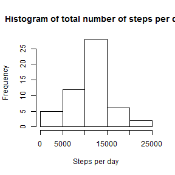
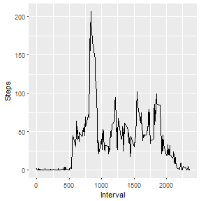
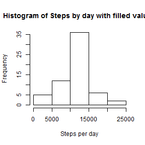
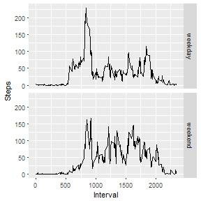

## Loading and preprocessing the data

1. Code for reading in the dataset and/or processing the data. <br>
Firstly, read download the file from the link provided, unzip and read the file into datased 'activity'. Remove all *null* entries and convert the *date* column to data type *date*.


```r
#Code for downloading and unzipping the file from the link provided
#temp <- tempfile()
#url <- "https://d396qusza40orc.cloudfront.net/repdata%2Fdata%2Factivity.zip"
#download.file(url,temp)
#activity <- unzip(temp, exdir ="./data")
#unlink(temp)

ori_activity <- read.csv("./data/activity.csv", header= TRUE, sep=",", fill=TRUE)
activity <- na.omit(ori_activity)
activity$date <- as.Date(activity$date,"%Y-%m-%d")
```

2. Histogram of the total number of steps taken each day <br>
Created a data table *stepsbyDay* for total steps by day. Then plot the histogram using the sum of steps from this table.


```r
library(data.table)#data manipulation

#to create a column of data for total no of steps by day
stepsbyDay <- setDT(activity)[ , list(mean_gr = mean(steps),sum_gr = sum(steps)) , by = date]

hist(stepsbyDay$sum_gr, main = "Histogram of total number of steps per day", xlab = "Steps per day")
```



## What is mean total number of steps taken per day?


```r
mean(stepsbyDay$sum_gr)
```

```
## [1] 10766.19
```

```r
median(stepsbyDay$sum_gr)
```

```
## [1] 10765
```

## What is the average daily activity pattern?

1. Make a time series plot (i.e. type = "l") of the 5-minute interval (x-axis) and the average number of steps taken, averaged across all
   days (y-axis)
   


```r
# calculate average number of steps per day based on 5 min interval 
steps_per_day <- aggregate(steps ~ interval, activity, mean)

library(ggplot2)#data visualization package

ggplot(data = steps_per_day,
       aes(x= interval, y= steps))+
   stat_summary(fun.y = mean, # average up all observations by day 
                geom = "line")+
   xlab("Interval") + ylab("Steps")
```




2. Which 5-minute interval, on average across all the days in the dataset, contains the maximum number of steps?


```r
steps_per_day[which.max(steps_per_day$steps),]
```

```
##     interval    steps
## 104      835 206.1698
```

## Imputing missing values

Note that there are a number of days/intervals where there are missing values (coded as NA). The presence of missing days may introduce bias into some calculations or summaries of the data.

1. Calculate and report the total number of missing values in the dataset (i.e. the total number of rows with NAs)


```r
ds_na <- length(which(is.na(ori_activity)))
ds_na
```

```
## [1] 2304
```

2. Devise a strategy for filling in all of the missing values in the dataset. Create a new dataset that is equal to the original dataset but with the missing data filled in with the mean of the 5-min interval.


```r
library(dplyr)#package for data wrangling

# join the mean columns to ori_activity 
imputed_activity <- ori_activity %>%left_join(steps_per_day, by = c("interval" = "interval")) 
   
# Put the mean value of its 5-minute interval (steps.y) into the NA entries in steps.x
imputed_activity$steps.x <- with(imputed_activity, 
      ifelse(is.na(imputed_activity$steps.x), imputed_activity$steps.y, imputed_activity$steps.x)) 

#remove the additional column steps.y
imputed_activity <- within(imputed_activity, rm("steps.y"))
```

Make a histogram of the total number of steps taken each day and Calculate and report the mean and median total number of steps taken per day. 


```r
#to create a column of data for total no of steps by day with filled values in NA data fields
stepsbyDayfilled <- setDT(imputed_activity)[ , list(mean_gr = mean(steps.x),
                                                    median_gr = median(steps.x), sum_gr = sum(steps.x)) , by = date]

hist(stepsbyDayfilled$sum_gr, main="Histogram of Steps by day with filled values", xlab = "Steps per day")
```



```r
mean(stepsbyDayfilled$sum_gr)
```

```
## [1] 10766.19
```

```r
median(stepsbyDayfilled$sum_gr)
```

```
## [1] 10766.19
```

## Are there differences in activity patterns between weekdays and weekends?

There is no difference in terms of mean value for data before and after imputing. There is only a slight difference in terms of median value both with and without imputing.

What is the impact of imputing missing data on the estimates of the total daily number of steps?

There is almost no impact to the original data after imputing the total daily number of steps. <br>

Are there differences in activity patterns between weekdays and weekends?

Create a new factor variable in the dataset with two levels - "weekday" and "weekend" indicating whether a given date is a weekday or weekend day in column *daytype*. For this part the weekdays() function may be of some help here but there is already a ready package called *chron* that can do the same thing too.


```r
library(chron) #package for is.weekend() to identify day that falls on weekends

imputed_activity$daytype <- with(imputed_activity, 
      ifelse(is.weekend(as.Date(imputed_activity$date)), "weekend", "weekday"))
```

Make a panel plot containing a time series plot (i.e. type = "l") of the 5-minute interval (x-axis) and the average number of steps taken, averaged across all weekday days or weekend days (y-axis). 


```r
ggplot(data = imputed_activity,
       aes(x= interval, y= steps.x)) + 
         facet_grid(daytype~.)+
         stat_summary(fun.y = mean, # average up all observations by day 
                geom = "line")+
         xlab("Interval") + ylab("Steps")
```


